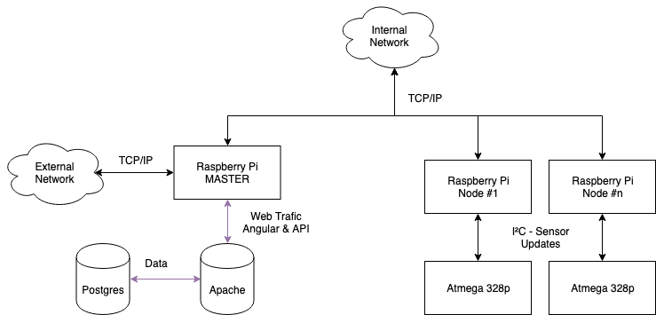

# Communication Analyse
[Go to General Analysis](../../analysis#communication)

## Network

### Protocol
Each node will communicate with the master using TCP/IP

### Parts
#### Node
* 1 switch (minimum 5 ports)  - [Part 4](#partslist)
* 5 x ethernet cable (shared between nodes)  - [Part 1](#partslist)

#### Master
* 1 switch (minimum 4 ports)  - [Part 3](#partslist)
* 4 x ethernet cable (shared between nodes)  - [Part 1](#partslist)

## Node

### Protocol
Internal communication happens with a few protocols:

* I²C
* USB
* TCP/IP

### Parts
* Shielded cable for I²C - [Part 2](#partslist)
* 1 x ethernet cable (already included in the Network segment) [Part 1](#partslist)
* 3 x USB cable (already included in the camera modules)

## Master

### Protocol
Master communicates over TCP/IP with the internal network and the outside world

* TCP/IP (Wired, Internal)
* TCP/IP (Wifi, Internet)

### Parts
* 1 x ethernet cable (already included in the Network segment)
* 1 x Wifi module (already included in the raspberry pi)

## Part list

> TODO: parts aren't concrete because the seller that AP uses isn't known to me 

1. Ethernet cable (1 Gbit/s)
    * [Possible cable (4.3 meter)](https://www.amazon.com/AmazonBasics-RJ45-Cat-6-Ethernet-Patch-Cable-14-Feet-4-3-Meters/dp/B00N2VJ2CG/ref=sxin_2?crid=KYIQGWN9LG3Z&keywords=cat+5+cable&pd_rd_i=B00N2VJ2CG&pd_rd_r=ec66b30f-1f01-4fc7-a367-20040bd349af&pd_rd_w=ad7Nu&pd_rd_wg=QorO8&pf_rd_p=70355792-caa9-41b7-bbcc-bee9ee21b884&pf_rd_r=AHTBSZHTBAW917YYM4EY&qid=1550337980&s=gateway&sprefix=cat+5%2Caps%2C220)
    * [Possible cable (7.6 meter)](https://www.amazon.com/AmazonBasics-RJ45-Cat-6-Ethernet-Patch-Cable-25-Feet-7-6-Meters/dp/B00N2VIWPY/ref=sxin_2?crid=KYIQGWN9LG3Z&keywords=cat+5+cable&pd_rd_i=B00N2VIWPY&pd_rd_r=ec66b30f-1f01-4fc7-a367-20040bd349af&pd_rd_w=ad7Nu&pd_rd_wg=QorO8&pf_rd_p=70355792-caa9-41b7-bbcc-bee9ee21b884&pf_rd_r=AHTBSZHTBAW917YYM4EY&qid=1550337980&s=gateway&sprefix=cat+5%2Caps%2C220)
    * RJ 45
    * Cat 5e or higher
    * 1 Gbit/s (Inter switch communication)
    * 3 - 6 meter (between nodes)

2. Ethernet cable (100 Mbit/s)
    * [Possible cable (1.5 meter)](https://www.amazon.com/AmazonBasics-RJ45-Cat-6-Ethernet-Patch-Cable-5-Feet-1-5-Meters/dp/B00N2VILDM/ref=sxin_2?crid=KYIQGWN9LG3Z&keywords=cat+5+cable&pd_rd_i=B00N2VILDM&pd_rd_r=ec66b30f-1f01-4fc7-a367-20040bd349af&pd_rd_w=ad7Nu&pd_rd_wg=QorO8&pf_rd_p=70355792-caa9-41b7-bbcc-bee9ee21b884&pf_rd_r=AHTBSZHTBAW917YYM4EY&qid=1550337980&s=gateway&sprefix=cat+5%2Caps%2C220)
    * [Possible cable (3 meter)](https://www.amazon.com/TP-Link-Ethernet-Optimization-Unmanaged-TL-SG105/dp/B00A128S24/ref=sr_1_1?fst=as%3Aoff&qid=1550337134&refinements=p_n_feature_four_browse-bin%3A5662321011&rnid=5662319011&s=pc&sr=1-1&th=1)
    * RJ 45
    * Cat 5 or higher
    * 100 Mb (Max Raspberry pi capable)
    * 1 - 3 meter (inside one node)

3. Switch (minimum 4 ports)
    * [Possible switch](https://www.amazon.com/TP-Link-Ethernet-Optimization-Unmanaged-TL-SG105/dp/B00A128S24/ref=sr_1_1?fst=as%3Aoff&qid=1550337134&refinements=p_n_feature_four_browse-bin%3A5662321011&rnid=5662319011&s=pc&sr=1-1&th=1)
    * 4 x RJ 45
    * Link speed > 100 Mbit/s

4. Switch (minimum 5 ports)
    * [Possible switch](https://www.amazon.com/TP-Link-Ethernet-Optimization-Unmanaged-TL-SG105/dp/B00A128S24/ref=sr_1_1?fst=as%3Aoff&qid=1550337134&refinements=p_n_feature_four_browse-bin%3A5662321011&rnid=5662319011&s=pc&sr=1-1&th=1)
    * 5 x RJ 45
    * Link speed > 100 Mbit/s