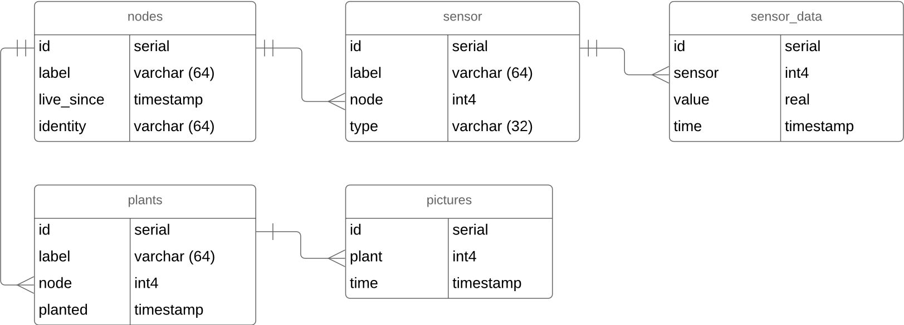

# Data Analyse
[Go to General Analysis](../../analysis#data--data-storage)

## Database
MongoDB - A free and open-source cross-platform document-oriented database program. Classified as a NoSQL database program, MongoDB uses JSON-like documents with schemas.

## Entity Relationship Diagram


## Database Interfaces
```typescript
interface Node {
  _id: ObjectID;
  label: string;
  live_since: Date;
  identity: string;
  status: number;
  sensors: Sensor[]       //Object IDs
  actuators: Actuator[]   //Object IDs
  plants: Plant[]         //Object IDs
}
```
```typescript
interface Sensor {
  _id: ObjectID;
  label: string;
  type: string;
  unit: string;
  data: SensorData[];     //Object IDs
}
```
```typescript
interface SensorData {
  _id: ObjectID;
  value: number;
  time: Date;
}
```
```typescript
interface Actuators {
  _id: ObjectID;
  label: string;
  type: string;
  value: number;
}
```
```typescript
interface Plant {
  _id: ObjectID;
  label: string;
  planted: Date;
  images: Image[]         //Object IDs
}
```
```typescript
interface Image {
  _id: MongoID,
  time: Date
}
```