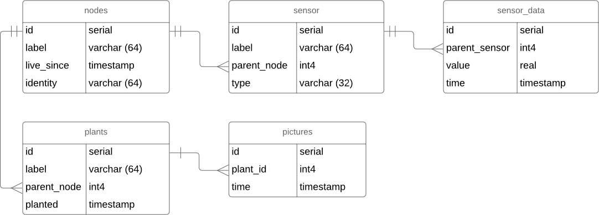

# Data Analyse
[Go to General Analysis](../../analysis#data--data-storage)

## Database
PostgreSQL - an object-relational database management system with an emphasis on extensibility and standards compliance.

## Entity Relationship Diagram


## Database Interfaces
```typescript
interface Node {
  id: serial;
  label: string;
  live_since: Date;
  identity: string;
}
```
```typescript
interface Sensor {
  id: serial;
  label: string;
  node: number;
}
```
```typescript
interface SensorData {
  id: serial;
  sensor: number;
  value: number;
  time: Date;
}
```
```typescript
interface Plant {
  id: serial;
  label: string;
  node: number;
  planted: Date;
}
```
```typescript
interface Image {
  id: serial,
  plant: string,
  time: Date
}
```