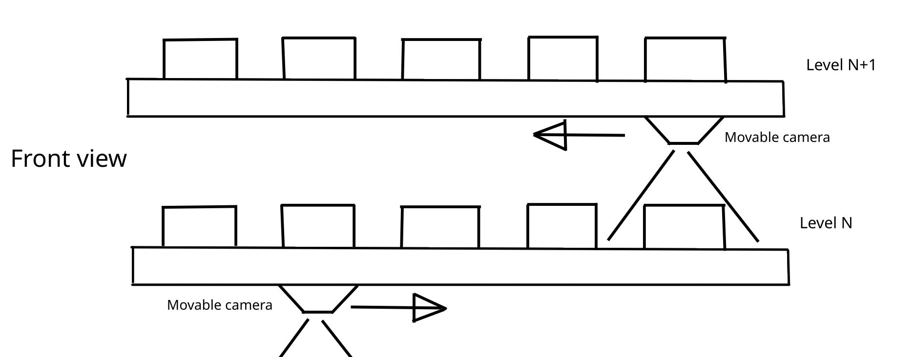
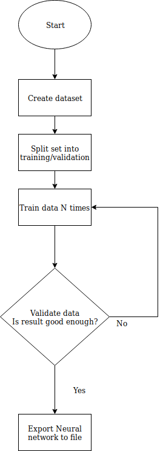
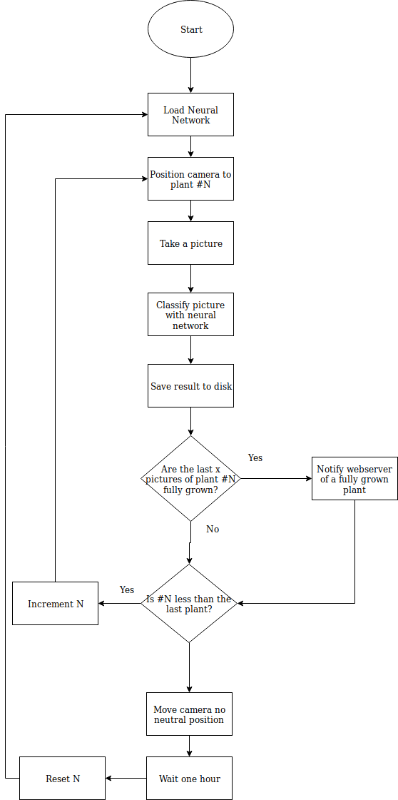

# Computer Vision Analyse
[Go to General Analysis](../../analysis#computer-vision)

## Functionality & Reason
Computer vision will be used to detect if a plant is fully grown.
If the plant is fully grown then a notification will be send to the user.
Every hour the program will take a picture of each plant and check if the plan is fully grown. If we have enough positive readings in a row then we send a notification. We check for multiple positive readings because our enviroment changes constantly (weather, lighting, day/night, etc). The network will use OpenCV (Open computer vision) in combination with usb camera's (one raspberry pi per module and 4 levels per module => 4 camera's). We will use image classifiers since we only have 1 plant per image (which is either fully grown or not). This means we need to train our own model. Either with imageAI or Caffe. To train our deep neural network we need a lot of images. Each type of classification requires a lots of images in different situations (different lighting, rotation, environment, etc). Part of our dataset will be used to train the data and part will be used to verify our network. The training will keep happening until our successrate is satisfactory. After our custom dataset is trained we can use our network inside the farm to detect the right plant.

## Structure
Each level of our module will have plants and our camera must be able to detect those plants. In order to decrease the amount of camera's needed the construction must have movable camera's. Each level of our construction will have one camera that can move to each plant.

## Flowchart
### Train

### Detect

